# Homelab Documentation

Welcome to the microLab!

My goal is to have a homelab with critical services being highly available, important services being self-healing, and optional services mostly available, while maintaining a small footprint and low power consumption. Here's a photo of the current lab setup.

This repo exists as part of the billv-ca/homelab-* series of repositories containing IaC and documentation for my homelab.

This repo contains documentation for the homelab-* series of repositories. See also:
- [homelab-atlantis-k3s-base-services](https://github.com/billv-ca/homelab-atlantis-k3s-base-services)
- [homelab-atlantis-k3s-services](https://github.com/billv-ca/homelab-atlantis-k3s-services)

## ⚙️ Hardware
### IoT Devices
A plethora of different devices all integrated with HomeAssistant. Mostly TP-Link for smart switches and outlets.

[Home Assistant Voice Preview Edition (x4)](https://www.home-assistant.io/voice-pe/)

### 🕸️ Network Infrastructure
#### Switches
- [TL-SG1016PE](https://www.tp-link.com/ca/business-networking/easy-smart-switch/tl-sg1016pe/) (Facebook Marketplace $75 unopened)
- [Proxmox Cluster 2.5G](https://www.aliexpress.com/item/1005006821314123.html)
- [Netgear GS105](https://www.netgear.com/ca-en/business/wired/switches/unmanaged/gs105/)

#### Access Points
- 3x [TP-Link Omada EAP-650](https://www.amazon.ca/dp/B0B12R9CYH)

#### Zigbee
- [SMLIGHT SLZB-06](https://aliexpress.com/item/1005004942648430.html)

#### Router
- [pfSense](https://www.pfsense.org/)
pfSense is a free and open source firewall and router that also features unified threat management, load balancing, multi WAN, and more.

  - [HP Elitedesk 800 G3 Mini (35W)](https://support.hp.com/lt-en/product/details/hp-elitedesk-800-35w-g3-desktop-mini-pc/15234602) - [Microcad.ca $94](https://www.microcad.ca/collections/refurbished-desktops)
    - Intel® Core™ i5-6500T CPU @ 2.50GHz
    - 8GB DDR4
    - 512GB NVME
    - 1Gbe on board
    - [2.5Gbe m.2 NIC](https://www.aliexpress.com/item/1005007273213520.html)

#### Network Diagram

```mermaid
graph
    ONT[*ONT* 💿] --> ROUTER[*Pfsense* 💻↔️🌐]
    ROUTER --> MAINSWITCH[*TL-SG1016PE* 💻🔗💻]
    MAINSWITCH --> VLAN0[**LAN** 🌐✂️🖥️]
    MAINSWITCH --> VLAN2[**IOT** 📡🌐✂️🖥️]
    MAINSWITCH --> VLAN1[**Main** 📡🌐✂️🖥️]
    MAINSWITCH --> VLAN4[**Guest** 📡🌐✂️🖥️]
    MAINSWITCH --> VLAN3[**Homelab** 🌐✂️🖥️]
    VLAN0 --> PCs[**PCs** ⌨️🖱️💻]
    VLAN1 --> AP[3 x *EAP-650* 🛜]
    AP -.-> WLDEV[**Wireless Devices** 📡]
    VLAN4 --> AP
    VLAN2 --> AP
    VLAN3 --> HLSW[*2.5G Switch* 💻🔗💻]
    HLSW --> PM[**Proxmox Nodes** 💻]
    VLAN3 --> ZIGBEE[**SMLIGHT SLZB-06** 🛜]
    ZIGBEE -.-> ZBDEV[**Zigbee Devices** 📡]
    VLAN2 --> NGSW[*Netgear GS105*]
    NGSW --> WSD[**Wired IoT Devices**]
```

---
### 🧠 Compute Nodes
- [HP Elitedesk 800 G4 Mini (35W)](https://support.hp.com/lt-en/product/details/hp-elitedesk-800-35w-g4-desktop-mini-pc/21353727) - [Microcad.ca $116](https://www.microcad.ca/collections/refurbished-desktops)
    - Intel® Core™ i5-8500T CPU @ 2.10GHz
    - 16GB DDR4
    - 256GB NVME
    - [1TB SATA III SSD](https://www.amazon.ca/dp/B09WMP5B5N)
    - 1Gbe on board - Used for AMT
    - [m.2 -> oculink adapter](https://www.amazon.ca/dp/B0DP4PL4JW)
    - [Minisforum DEG1 eGPU dock](https://www.amazon.ca/dp/B0DPGYKH7G)
    - [ASUS AMD 7800XT](https://www.canadacomputers.com/en/powered-by-amd/250620/asus-dual-radeon-rx-7800-xt-oc-edition-16gb-gddr6-dual-rx7800xt-o16g.html)
    - [FSP VITA 750W power supply](https://www.canadacomputers.com/en/power-supplies/253950/fsp-vita-750gm-80-gold-750-watt-atx-3-1-power-supply-vita-750gm.html)
    - [2.5Gbe m.2 NIC](https://www.aliexpress.com/item/1005007273213520.html)

- [HP Elitedesk 800 G3 Mini (35W)](https://support.hp.com/lt-en/product/details/hp-elitedesk-800-35w-g3-desktop-mini-pc/15234602) - [Microcad.ca $94](https://www.microcad.ca/collections/refurbished-desktops)
    - Intel® Core™ i5-6500T CPU @ 2.50GHz
    - 16GB DDR4
    - 256GB NVME
    - [1TB SATA III SSD](https://www.amazon.ca/dp/B09WMP5B5N)
    - 1Gbe on board - Used for AMT
    - [2.5Gbe m.2 NIC](https://www.aliexpress.com/item/1005007273213520.html)

- [HP Elitedesk 800 G3 Mini (65W)](https://support.hp.com/lt-en/product/details/hp-elitedesk-800-65w-g3-desktop-mini-pc/15497277) - [Microcad.ca $94](https://www.microcad.ca/collections/refurbished-desktops)
    - Intel® Core™ i5-6500 CPU @ 3.20GHz
    - 24GB DDR4
    - 256GB NVME
    - [1TB SATA III SSD](https://www.amazon.ca/dp/B09WMP5B5N)
    - 1Gbe on board - Used for AMT
    - [2.5Gbe m.2 NIC](https://www.aliexpress.com/item/1005007273213520.html)

### 🔌 Power Supplies
- [APC Back-UPS ES 350VA](https://www.apc.com/ca/en/product/BE350G-CN/apc-backups-es-350va-120v-without-autoshutdown-software/)
---
## 🖥️ Software

### 🐧 Proxmox VE
[Proxmox](https://www.proxmox.com/en/products/proxmox-virtual-environment/overview) is a complete, open-source server management platform for enterprise virtualization. It tightly integrates the KVM hypervisor and Linux Containers (LXC), software-defined storage and networking functionality, on a single platform. With the integrated web-based user interface you can manage VMs and containers, high availability for clusters, or the integrated disaster recovery tools with ease.

🔑 Integrated with [Authentik](https://goauthentik.io/)

### rocm-wyoming-whisper
[rocm-wyoming-whisper](https://github.com/fyhertz/rocm-wyoming-whisper) A docker image and a few lines of python to use OpenAI whisper with Rhasspy and/or Home Assistant on AMD GPUs with ROCm.

Used with a HomeAssistant voice pipeline for insanely fast speech to text.

#### Virtual Machines
- Kubernetes
  - k3s-0
  - k3s-2
- OpenMediaVault
- Home Assistant
- Crafty Controller

### 📁 OpenMediaVault
[OMV](https://www.openmediavault.org/) is the next generation network attached storage (NAS) solution based on Debian Linux. It contains services like SSH, (S)FTP, SMB/CIFS, RSync and many more ready to use. Thanks to the modular design of the framework it can be enhanced via plugins. openmediavault is primarily designed to be used in small offices or home offices, but is not limited to those scenarios. It is a simple and easy to use out-of-the-box solution that will allow everyone to install and administrate a Network Attached Storage without deeper knowledge.

### 🏠 Home Assistant
[Home Assistant](https://www.home-assistant.io/) is open source home automation that puts local control and privacy first. Powered by a worldwide community of tinkerers and DIY enthusiasts.

##### Add Ons
- [File Editor](https://github.com/home-assistant/addons/tree/master/configurator)
- [Music Assistant](https://www.music-assistant.io/)
- [Mosquitto](https://github.com/home-assistant/addons/tree/master/mosquitto)
- [Zigbee2MQTT](https://github.com/zigbee2mqtt/hassio-zigbee2mqtt/tree/master/zigbee2mqtt)
- [Piper](https://github.com/home-assistant/addons/blob/master/piper)
- [Whisper](https://github.com/home-assistant/addons/blob/master/whisper)

### 🧱 Crafty Controller
[Crafty Controller](https://craftycontrol.com/) is a cross-platform Minecraft server control platform that you control from your web browser.

### 🐳 K3s Kubernetes
[K3s](https://k3s.io/) is lightweight Kubernetes. Easy to install, half the memory, all in a binary of less than 100 MB.

#### 🌍 Kubernetes Services
|Service|Category|Description|Authentik Integration|
|-------|--------|-----------|---------------------|
|Atlantis|IaC Deployment|[Atlantis](https://runatlantis.io) is Terraform Pull Request Automation.|✅|
|Authentik|Identity|[Authentik](https://goauthentik.io/) is a self-hosted, open-source identity provider.||
|Cert Manager|Network|[cert-manager](https://cert-manager.io/) is a powerful and extensible X.509 certificate controller for Kubernetes and OpenShift workloads. It will obtain certificates from a variety of Issuers, both popular public Issuers as well as private Issuers, and ensure the certificates are valid and up-to-date, and will attempt to renew certificates at a configured time before expiry.|
|Grafana|Monitoring|With [Grafana](https://grafana.com/grafana/) you can create, explore, and share all of your data through beautiful, flexible dashboards.|✅|
|Longhorn|Storage|[Longhorn](https://longhorn.io/) provides cloud-native persistent block storage.|✅|
|Mealie|Recipe Storage|[Mealie](https://mealie.io/) is an intuitive recipe management app.|✅|
|Meshcentral|System Tools|[Meshcentral](https://meshcentral.com/) is an open source, multi-platform, self-hosted, feature packed web site for remote device management with support for Intel AMT.|✅|
|MetalLB|Network|[MetalLB](https://metallb.io/) is a load-balancer for bare-metal Kubernetes.|
|OCIS|File Sync|Welcome to [oCIS](https://owncloud.dev/ocis/), the modern file-sync and share platform, which is based on our knowledge and experience with the PHP based ownCloud server.|✅|
|Ollama|AI|[Ollama](https://ollama.com) lets you run large language models locally.||
|Omada Software Controller|Network|[Omada software controller](https://github.com/mbentley/docker-omada-controller) manages Omada APs.|
|Open WebUI|AI|[Open WebUI](https://openwebui.com/) is an extensible, self-hosted AI interface that adapts to your workflow, all while operating entirely offline.|✅|
|Orca Slicer|3d Printing|[Orca Slicer](https://github.com/SoftFever/OrcaSlicer): an open source Next-Gen Slicing Software for Precision 3D Prints|✅|
|Pi-hole|Network|[Pi-hole](https://pi-hole.net/) offers network-wide ad protection.|✅|
|Prometheus|Monitoring|[Prometheus](https://prometheus.io/). Monitor your applications, systems, and services with the leading open source monitoring solution. Instrument, collect, store, and query your metrics for alerting, dashboarding, and other use cases.||
|ROCm k8s-device-plugin|System Plugin|[ROCm k8s-device-plugin](https://github.com/ROCm/k8s-device-plugin) enables AMD GPU registration in Kubernetes clusters.||
|Traefik|Network|[Traefik](https://traefik.io/traefik/) is a leading modern open source reverse proxy and ingress controller that makes deploying services and APIs easy. Traefik integrates with your existing ...|✅|
|Trilium|Notes|[Trilium](https://github.com/triliumnext) is an open-source knowledge base and note-taking application|✅|
|Wireguard UI|System Tools|[Wireguard UI](https://github.com/ngoduykhanh/wireguard-ui) is a web user interface to manage your WireGuard setup.|✅|
|Wireguard|Network|[Wireguard](https://www.wireguard.com/): fast, modern, secure VPN tunnel. WireGuard® is an extremely simple yet fast and modern VPN that utilizes state-of-the-art cryptography.|

## 3D print(er)s

### 3D models used in my lab
- [1U rackmount for HP Elitedesk G3 mini and newer (Thanks Spekkie3D)](https://www.printables.com/model/658936-1u-rackmount-for-hp-elitedesk-g3-mini-and-newer)
- [elietedesk 800 g3 mini youyeetoo 2.5g nic i225v](https://www.thingiverse.com/thing:6899748)

### 3D printer used in my lab
- [Elegoo Centauri Carbon](https://ca.elegoo.com/products/centauri-carbon)
